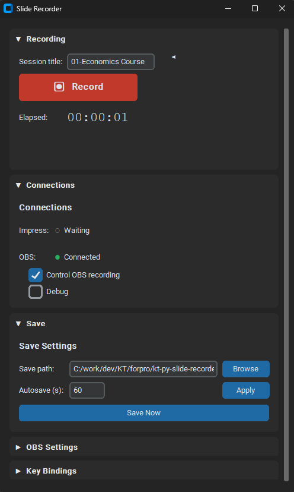
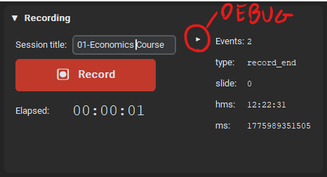
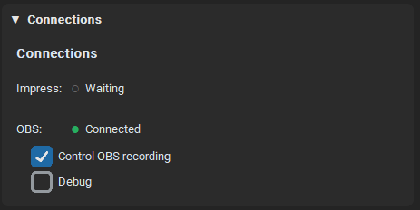
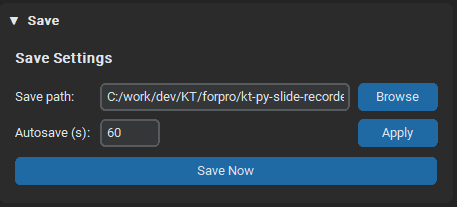
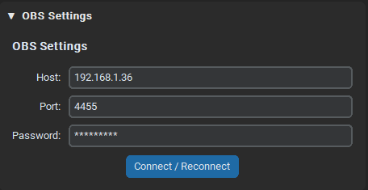
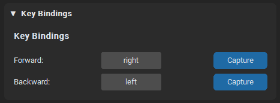

# Slide Recorder

Desktop application that records slide transitions during a LibreOffice Impress presentation and exports them as timestamped JSON. Optionally controls OBS recording automatically.



---

## Requirements

- **Python 3.10+**
- **LibreOffice Impress 7.0+** (optional — for automatic slide detection)
- **OBS Studio** with WebSocket v5 enabled (optional — for recording control)

## Installation

### 1. Dependencies

On Windows just run `launcher.bat` — it creates the virtual environment and installs dependencies automatically.

For manual installation:

```bash
python -m venv .venv
.venv\Scripts\activate      # Windows
pip install -r requirements.txt
```

### 2. LibreOffice Impress Macro (optional)

To let the app detect slide changes automatically, install a macro in LibreOffice:

1. Copy `impress_extension/slide_recorder_macro.py` into the LibreOffice Python scripts folder:

   | OS      | Path                                                               |
   | ------- | ------------------------------------------------------------------ |
   | Windows | `%APPDATA%\LibreOffice\4\user\Scripts\python\`                     |
   | macOS   | `~/Library/Application Support/LibreOffice/4/user/Scripts/python/` |
   | Linux   | `~/.config/libreoffice/4/user/Scripts/python/`                     |

   Create the `python` folder if it doesn't exist.

2. In LibreOffice: **Tools → Options → LibreOffice → Security → Macro Security** → set to **Medium** → OK → restart LibreOffice.

3. With a presentation open: **Tools → Macros → Organize Python Macros...** → select `slide_recorder_macro` → `RegisterSlideRecorderListeners` → **Run**.

   This needs to be done once per LibreOffice session.

> **Auto-run on startup:** Tools → Customize → Events tab → "Start Application" event → assign the `RegisterSlideRecorderListeners` macro.

---

## Usage

### Starting the application

```bash
# Windows (recommended)
launcher.bat

# Manual
python main.py
```

### Recording workflow

1. **Title** — Enter a session name (default: `recording`).
2. **Save path** — Choose the output folder with _Browse_ or keep the default (`tests/results/`).
3. **Record** — Start recording. The timer begins.
4. **Navigate** — Use the forward/backward keys (arrow keys by default) to register slide changes.
5. **Stop** — Stop recording. The JSON is saved automatically to the selected path.

---

## Interface

### Recording



| Control       | Description                                                                               |
| ------------- | ----------------------------------------------------------------------------------------- |
| Title         | Session name (used as the JSON filename)                                                  |
| Record / Stop | Start or stop recording                                                                   |
| Timer         | Elapsed time in `HH:MM:SS` format                                                         |
| Debug panel   | Collapsible side panel showing real-time info: event count, type, slide index, timestamps |

### Connections



| Control               | Description                                                                                   |
| --------------------- | --------------------------------------------------------------------------------------------- |
| Impress               | Connection indicator (● green = in presentation, ● yellow = connected, ○ grey = disconnected) |
| OBS                   | Connection indicator (● green = connected/recording, ○ grey = disconnected)                   |
| Control OBS recording | When enabled, starts/stops OBS recording along with the session                               |
| Debug                 | When enabled, shows alert dialogs with OBS connection attempt results                         |

### Save



| Control           | Description                                                  |
| ----------------- | ------------------------------------------------------------ |
| Save path         | Output JSON file path. Changing it updates the session title |
| Autosave interval | Auto-save frequency in seconds (minimum 5s, default 60s)     |
| Save Now          | Save the current session manually at any time                |

### OBS Settings



| Field               | Default     | Description                                    |
| ------------------- | ----------- | ---------------------------------------------- |
| Host                | `localhost` | OBS WebSocket server address                   |
| Port                | `4455`      | OBS WebSocket port                             |
| Password            | _(empty)_   | OBS authentication password                    |
| Connect / Reconnect |             | Connect or reconnect with the updated settings |

> OBS can run on the same machine or on another machine on the local network.

### Key Bindings



| Key      | Default         | Description             |
| -------- | --------------- | ----------------------- |
| Forward  | Right arrow (→) | Register slide advance  |
| Backward | Left arrow (←)  | Register slide backward |

To rebind a key: click **Capture** then press the desired key. Changes apply immediately.

---

## Output Format (JSON)

```json
{
  "title": "my_presentation",
  "session_start_iso": "2026-04-12T10:30:00.000000+02:00",
  "duration_s": 120.5,
  "total_events": 4,
  "events": [
    {
      "time_hms": "00:00:00",
      "time_ms": 0,
      "slide_index": 0,
      "event_type": "initial"
    },
    {
      "time_hms": "00:00:15",
      "time_ms": 15234,
      "slide_index": 1,
      "event_type": "slide_changed"
    },
    {
      "time_hms": "00:01:42",
      "time_ms": 102450,
      "slide_index": 2,
      "event_type": "slide_changed"
    },
    {
      "time_hms": "00:02:00",
      "time_ms": 120500,
      "slide_index": 2,
      "event_type": "record_end"
    }
  ]
}
```

| Field               | Description                                 |
| ------------------- | ------------------------------------------- |
| `title`             | Session name                                |
| `session_start_iso` | Start date and time (ISO 8601)              |
| `duration_s`        | Total duration in seconds                   |
| `total_events`      | Number of recorded events                   |
| `time_hms`          | Event timestamp in `HH:MM:SS` format        |
| `time_ms`           | Milliseconds since recording started        |
| `slide_index`       | Current slide index (0-based)               |
| `event_type`        | `initial`, `slide_changed`, or `record_end` |

> The final JSON only contains relevant events: `initial` (on Record press), `slide_changed` (slide transitions), and `record_end` (on Stop press). Intermediate navigation events are filtered out.

---

## Configuration

All settings are saved automatically to `config.json` in the project root. It is created automatically the first time a setting is changed. No manual editing is needed.

---

## Troubleshooting

| Problem                 | Solution                                                                                                             |
| ----------------------- | -------------------------------------------------------------------------------------------------------------------- |
| Slides are not detected | Make sure you ran `RegisterSlideRecorderListeners` in LibreOffice while the app is running                           |
| OBS won't connect       | Check Host, Port, and Password in OBS Settings. Enable the _Debug_ checkbox in Connections to see the specific error |
| Macro doesn't appear    | Verify that `slide_recorder_macro.py` is in the correct folder and macro security is set to _Medium_                 |
| Port mismatch           | If the port is changed in the app, update `BRIDGE_PORT` in `slide_recorder_macro.py` accordingly                     |
